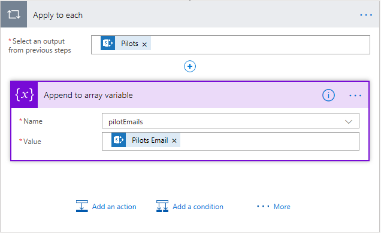
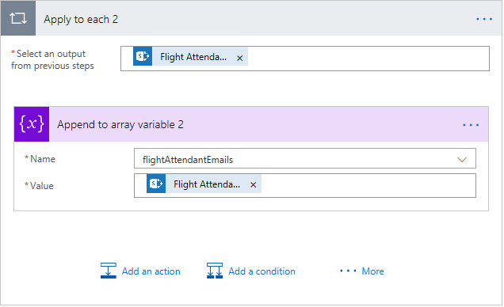
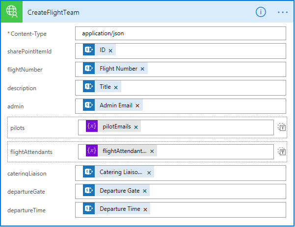

# Set up for end-to-end demo

## Configure O365

- [Enable guest access for Teams](https://docs.microsoft.com/en-us/microsoftteams/set-up-guests)

## Create SharePoint site

1. Go to your Office 365 organization's root SharePoint site.
1. Choose **Create Site**, then choose **Team site**. Name the site `Flight Admin` and choose **Next**, then choose **Finish**.
1. When the new site loads in the browser, locate the **Documents** web part. Using either the **New** or the **Upload** button in that webpart, add a Word document called `Flight Log.docx`.
1. On the site's home page, choose **New** in the upper-left corner, then choose **List**. Name the list `Master Flight List` and choose **Create**.
1. When the new list loads in the browser, use the **Add column** button to add the following columns:

    | Name | Type | Require a value? | Other settings |
    |------|------|------------------|------------------------|
    | Flight Number | Number | Yes | **Number of decimal places:** 0, **Enforce unique values:** Yes |
    | Admin | Person | Yes | **Allow selection of groups:** No, **Allow multiple selections:** No |
    | Pilots | Person | Yes | **Allow selection of groups:** No, **Allow multiple selections:** Yes |
    | Flight Attendants | Person | Yes | **Allow selection of groups:** No, **Allow multiple selections:** Yes |
    | Catering Liaison | Person | Yes | **Allow selection of groups:** No, **Allow multiple selections:** No |
    | Departure Gate | Single line of text | Yes | |
    | Departure Time | Date | Yes | **Include time:** Yes |

When you're done, the list should look something like this.


## Provision Azure Resources

### Create a new Function App

1. Go to the [Azure Portal](https://portal.azure.com). Use the **Create a resource** button to add a new **Function App**.
1. Once the app is created, navigate to it in the Azure Portal and select **Platform Features**.
1. Choose **Function app settings**, then change the **Runtime version** to `~2 (Preview)`.
1. Select **Overview** then select **Get publish profile**. Save the downloaded file, you'll need it later.
1. Copy the **URL** value, you'll need it later.

### Create app registrations

You need to create two app registration in the Azure Portal.

1. Choose **Azure Active Directory** in the left-hand navigation in the Azure Portal.
1. Under **Manage**, choose **App registrations**.

### Register app for Azure Function

1. Choose **New application registration**.
1. Set the **Name** to `Flight Team Provisioning Function`.
1. Set **Application Type** to **Web app / API**.
1. Set **Sign-on URL** to the URL for the Azure Functions app, then choose **Create**.
1. Copy the value of **Application ID**, you will need it later.
1. Choose **Settings**, then choose **Required permissions**.
1. Choose **Add**, then **Select an API**. Choose **Microsoft Graph**, then choose **Select**.
1. Select the following under **Delegated permissions**:
    - **Read and write all groups**
    - **Read all users' full profiles**
1. Choose **Select**, then **Done**.
1. In the **Settings** blade, choose **Keys**.
1. Under **Passwords**, enter a description, select a duration, then choose **Save**. Copy the **Value**, you will need it later.

### Register app for Microsoft Flow

1. Choose **New application registration**.
1. Set the **Name** to `Flight Team Provisioning Connector`.
1. Set **Application Type** to **Web app / API**.
1. Set **Sign-on URL** to `https://localhost`, then choose **Create**.
1. Copy the value of **Application ID**, you will need it later.
1. Choose **Settings**, then choose **Required permissions**.
1. Choose **Add**, then **Select an API**. Type `Flight Team Provisioning Function` in the search box, then select **Flight Team Provisioning Function** in the list. Choose **Select**.
1. Select the following under **Delegated permissions**:
    - **Access Flight Team Provisioning Function**
1. Choose **Select**, then **Done**.
1. In the **Settings** blade, choose **Keys**.
1. Under **Passwords**, enter a description, select a duration, then choose **Save**. Copy the **Value**, you will need it later.

### Update the app registration for the Azure Function

1. Navigate to the `Flight Team Provisioning Function` app registration, then select **Manifest**.
1. In the **Edit manifest** window, locate the line `"knownClientApplications": [],`, and replace it with the following (replacing `app-id-for-flight-team-provisioning-connector` with the application ID for your `Flight Team Provisioning Connector` app registration):

    ```json
    "knownClientApplications": [
      "app-id-for-flight-team-provisioning-connector"
    ]
    ```

1. Chose **Save**.

### Record Admin consent

Some of the permissions required by this sample require an administrator to consent.

## Configure Microsoft Flow

### Add custom connector for Azure functions

1. Rename the **postman_collection.json.example** to **postman_collection.json**, then open it in a text editor.
1. Replace all instances of `https://<your-azure-function-url>` with the URL to your Function App. Save your changes.
1. Go to [Microsoft Flow](https://flow.microsoft.com). Select the "gear" icon in the top right, then choose **Custom Connectors**.
1. Choose **Create custom connector**, then choose **Import a Postman collection**.
1. Enter `Contoso Team Provisioning` for **Custom connector name**, then browse for **postman_collection.json** in the **Upload a postman collection (V1)** field. Choose **Continue**.
1. Under **General information**, verify that the **Host** field matches the URL of your Functions App, and the **Base URL** is set to `/`. Choose **Security**.
1. Change **Authentication type** to **OAuth 2.0**, then fill in the fields as follows:
    1. Change **Identity Provider** to **Azure Active Directory**.
    1. Enter the application ID for the `Flight Team Provisioning Connector` app registration in the **Client id** field.
    1. Enter the application password for the `Flight Team Provisioning Connector` app registration in the **Client secret** field.
    1. Enter the application ID for the `Flight Team Provisioning Function` in the **Resource URL** field.
    1. Leave all other fields as their default values.
1. Select **Create connector**. Copy the value of the **Redirect URL**, you will need it later.

### Update app registration for Microsoft Flow

1. In the Azure Portal, navigate to the `Flight Team Provisioning Connector` app registration.
1. Select **Settings**, then **Reply URLs**.
1. Add the value of **Redirect URL** you copied when creating the custom Flow connector to the list of reply URLs, and choose **Save**.
1. Select **Manifest**

### Create the "Create Team" flow

1. Go to [Microsoft Flow](https://flow.microsoft.com). Choose **My flows**.
1. Choose **Create from blank**.
1. On the next page, choose **Create from blank**.
1. Enter `SharePoint` in the search box, then select **SharePoint - When an item is created**.
    1. Enter the URL to your **Flight Admin** site you created earlier for **Site Address**, then select **Master Flight List** for **List Name**.

    

1. Choose **New Step**, then **Add an action**.
1. Enter `variable` in the search box, then select **Variables - Initialize variable**.
    1. Enter `pilotEmails` for **Name**, change **Type** to **Array**, leave **Value** blank.

    

1. Choose **New Step**, then **More**, then **Add an apply to each**.
    1. For **Select an output from previous steps**, under **Dynamic content** select **Pilots**.
    1. Choose **Add an action**
    1. Enter `variable` in the search box, then select **Variables - Append to array variable**.
        1. Enter `pilotEmails` for **Name**.
        1. For **Value**, under **Dynamic content** select **Pilots Email**.

    

1. Choose **New Step**, then **Add an action**.
1. Enter `variable` in the search box, then select **Variables - Initialize variable**.
    1. Enter `flightAttendantEmails` for **Name**, change **Type** to **Array**, leave **Value** blank.

    

1. Choose **New Step**, then **More**, then **Add an apply to each**.
    1. For **Select an output from previous steps**, under **Dynamic content** select **Flight Attendants**.
    1. Choose **Add an action**
    1. Enter `variable` in the search box, then select **Variables - Append to array variable**.
        1. Enter `flightAttendantEmails` for **Name**.
        1. For **Value**, under **Dynamic content** select **Flight Attendants Email**.

    

1. Choose **New Step**, then **Add an action**.
1. Enter `Contoso` in the search box, then select **Contoso Team Provisioning - CreateFlightTeam**.
1. Choose **Sign in**. **Be sure to use an administrator account** when you sign in to create the connection. The permissions required by the sample require administrator consent.
1. Once sign in and consent are complete, you should see a form for the action. Fill in the fields as follows using the Flow UI.
    1. **flightNumber**: Under **Dynamic content** choose **See more**, then select **Flight Number**.
    1. **description**: Under **Dynamic content** select **Title**.
    1. **admin**: Under **Dynamic content** select **Admin Email**.
    1. **pilots**: Choose the **Switch to input entire array** toggle to the right of the input box, then place your cursor in the input box. Under **Dynamic content**, select **pilotEmails**.
    1. **flightAttendants**: Choose the **Switch to input entire array** toggle to the right of the input box, then place your cursor in the input box. Under **Dynamic content**, select **flightAttendantEmails**.
    1. **cateringLiaison**: Under **Dynamic content** select **Catering Liaison Email**.
    1. **departureGate**: Under **Dynamic content** select **Departure Gate**.
    1. **departureTime**: Under **Dynamic content** select **Departure Time**.

    

1. Choose **New Step**, then **Add an action**.
1. Enter `notification` in the search box, then select **Notifications - Send me an email notification**.
    1. For **Subject**, enter `Microsoft Team created for Flight `, then under **Dynamic content** choose **See more**, then select **Flight Number**.
    1. For **Body**, under **Dynamic content** select **Link to item**.

    

1. Hover over the arrow above the **Send me an email notification** action and choose the **+**, then **Add a parallel branch**, then **Add an action**.
1. Enter `notification` in the search box, then select **Notifications - Send me an email notification**.
    1. For **Subject**, enter `Error creating Microsoft Team for Flight `, then under **Dynamic content** choose **See more**, then select **Flight Number**.
    1. For **Body**, enter `Details: `, then under **Dynamic content** select **Body**.
    1. Choose the **...** on the action and choose **Configure run after**.
        1. Unselect **is successful**
        1. Select **has failed**
        1. Choose **Done**.

    

The email notification actions should look like the following when you're done.


Select **Save** to save the flow.

### Create the "Archive Team" flow